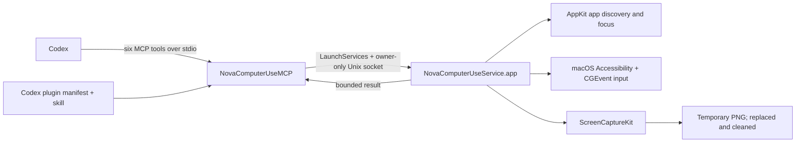

# NOVA COMPUTER USE

**Native, local-first Computer Use for Codex on Intel and Apple Silicon Macs.**

[](https://github.com/theodorebeaupre-prog/nova-computer-use/actions/workflows/ci.yml)
[](#compatibility)
[](Package.swift)
[](LICENSE)

> [!IMPORTANT]
> The native engine, SwiftUI installer source, and local development packaging are available now. A Developer ID-signed and notarized public DMG has **not** been released yet.

## Why Nova

Codex is excellent at understanding work. Nova gives it a small, auditable set of native macOS tools for the moments when work must happen in an app: inspect the visible interface, click, type, press keys, and scroll.

Nova is intentionally narrow:

- six tools instead of unrestricted desktop automation;
- a native Swift helper with explicit macOS permissions;
- no network code in the computer-control engine;
- bounded requests, responses, screenshots, and Accessibility snapshots;
- one universal build for modern Intel and Apple Silicon Macs.

## Capabilities

| Tool | What it does |
| --- | --- |
| `list_apps` | Lists running, user-facing GUI applications. |
| `get_app_state` | Focuses an app and returns its current Accessibility snapshot plus a main-display capture. Call this before interacting. |
| `click` | Clicks a fresh Accessibility element index or explicit screen coordinates. |
| `type_text` | Types literal Unicode text into the focused app. |
| `press_key` | Presses a key or shortcut such as `Return`, `Tab`, or `super+c`. |
| `scroll` | Scrolls up, down, left, or right by 1–10 pages, optionally over a fresh element. |

Nova accepts an app's display name, executable path, or bundle identifier. Prefix matching is accepted only when it identifies one running app.

## Compatibility

| Mac | Build output | Automated verification | Real-hardware acceptance |
| --- | --- | --- | --- |
| Intel (`x86_64`) | Included | Swift suite, package fixture, signing, MCP handshake, and local install verified | Partial: bounded `list_apps` verified; full six-tool run pending |
| Apple Silicon (`arm64`) | Included | Cross-built slice combined and inspected in the universal binaries | Pending on Apple Silicon hardware |

Nova requires macOS 15 or newer and a Swift 6 toolchain. The package declares both native executables and the reusable `NovaComputerUseCore` library in [Package.swift](Package.swift).

## Quick Start

### Build the Nova app

Build the universal SwiftUI installer and a local-development DMG:

```bash
scripts/build-app.sh
scripts/verify-app.sh dist/Nova.app
scripts/package-dmg.sh
open dist/Nova.app
```

The DMG uses Nova’s custom spatial installation background and a fixed drag-to-Applications layout.

The app guides users through compatibility checks, macOS permission panes, plugin installation, repair, a safe TextEdit test, and uninstall. Local builds are ad-hoc signed, so macOS permissions may need to be granted again after rebuilding. Stable permission identity requires the future Developer ID-signed release.

### Build from source

Until a release archive is published, build the verified universal plugin from a local checkout:

```bash
DEVELOPER_DIR=/Applications/Xcode.app/Contents/Developer scripts/build-universal.sh
scripts/verify-release.sh dist/NovaComputerUsePlugin
scripts/install-local.sh
```

The install script validates both architectures, manifests, plist, and code signatures before copying version `1.0.0` to `~/.codex/plugins/cache/nova/computer-use/`. It preserves the first pre-Nova configuration at `~/.codex/config.toml.nova-computer-use.backup` and manages only the `computer-use@nova` block in `config.toml`.

The source build is ad-hoc signed by default. Release operators can set `CODE_SIGN_IDENTITY` to a suitable signing identity; that does not make the current build notarized.

To remove Nova-owned plugin files and configuration while preserving the backup:

```bash
scripts/uninstall-local.sh
```

### Release archive

No release archive is published yet. This section will gain a checksum-backed download and installation command only after that artifact has passed `scripts/verify-release.sh`; until then, use the source flow above.

## macOS Permissions

On first use, macOS may ask for two permissions. Open **System Settings → Privacy & Security** and enable **NovaComputerUseService** under:

1. **Accessibility** — required to inspect controls and send clicks, text, keys, and scroll events.
2. **Screen Recording** (wording may vary by macOS release) — required by `get_app_state` to capture the main display.

Nova does not edit the TCC permission database or bypass macOS consent. If the helper is not listed, run a Nova tool once to let macOS present the normal prompt, then return to System Settings. Restart the affected Nova/Codex processes after changing a permission so macOS can apply it cleanly.

## Architecture



The MCP adapter starts one app-helper process through LaunchServices for the lifetime of each MCP session, so permissions belong to the stable helper bundle identifier `dev.theodorebeaupre.NovaComputerUse.Service` and Accessibility snapshot indexes remain usable by the next tool call. Request and response payloads travel through a `0600` Unix-domain socket inside a `0700` session directory and are not written as regular IPC files. Before dispatching a request, both processes verify that the peer is the exact bundled, validly signed executable and complete a fresh 32-byte challenge in each direction. These session secrets exist only in memory and on the connected socket, never in arguments or regular files. Direct stdio use of the helper is rejected.

## Security Model

### Guarantees in the Nova engine

- Computer-control operations contain no network requests.
- Typed text and Accessibility trees are exchanged in memory and are not intentionally persisted by Nova.
- The current display capture is a temporary PNG. Its returned path remains usable until a successfully finalized capture replaces it or orderly MCP/helper shutdown removes it. Failed backend captures or PNG finalization preserve the prior path and remove any partial candidate; a later service start sweeps stale Nova PNGs left by an interrupted process.
- One authenticated helper and its Accessibility snapshot state are retained across MCP tool calls. A 30-second heartbeat keeps the session alive, while the helper independently exits and cleans up after 120 seconds without authenticated traffic.
- The helper accepts requests only from the exact bundled MCP executable over the owner-only socket. The MCP applies the reciprocal code-signature and path check before sending a request.
- Input is sent only after Nova resolves the requested running app and verifies it became frontmost.
- Accessibility element indexes belong to the latest snapshot for that app. Replaced snapshots fail closed with `stale_snapshot`.
- IPC frames and MCP response lines are capped at 1 MiB; Accessibility snapshots and attributes have smaller explicit limits.
- The installer stages and validates the plugin before publication, backs up configuration, and never edits TCC.

### Limitations you should understand

Nova has powerful Accessibility and Screen Recording access. A requested click, keystroke, or typed string can change data in another app. Review sensitive or destructive actions before allowing them.

“Local-first” describes the Nova engine, not every system around it. Nova returns app state and a local capture path to Codex; how Codex or its configured model processes that result is governed by Codex's own settings and policies. Nova does not encrypt the temporary screenshot at rest, and a hard crash can leave it until a later cleanup sweep. Do not test with passwords, private conversations, financial data, or other sensitive content.

## Development

Run the complete Swift package suite:

```bash
DEVELOPER_DIR=/Applications/Xcode.app/Contents/Developer swift test
```

Run the packaging fixture, build both architectures, and verify the real distribution:

```bash
bash Tests/ScriptTests/UniversalBuildTests.sh
DEVELOPER_DIR=/Applications/Xcode.app/Contents/Developer scripts/build-universal.sh
scripts/verify-release.sh dist/NovaComputerUsePlugin
scripts/build-app.sh
scripts/verify-app.sh dist/Nova.app
scripts/package-dmg.sh
```

The release verifier parses both manifests and the helper plist, checks both Mach-O slices and code signatures, verifies the helper identifier, rejects direct helper use, negotiates MCP, requires exactly the six documented tools, and performs two bounded `list_apps` calls through the same helper process. It also checks that no session secret appears in process arguments or regular IPC files and that the helper and IPC directory disappear after MCP shutdown.

## Troubleshooting

Nova returns stable service error codes. Start with the exact code rather than sharing a screenshot or full Accessibility result.

| Error code | Meaning | Recovery |
| --- | --- | --- |
| `permission_denied_accessibility` | The helper cannot inspect or control apps. | Enable **NovaComputerUseService** under Accessibility, then retry from a fresh process. |
| `permission_denied_screen_recording` | `get_app_state` cannot capture the display. | Enable **NovaComputerUseService** under Screen Recording, then retry from a fresh process. |
| `application_not_found` | No unique running app matched, or the app could not become frontmost. | Open the app and retry with its exact display name or bundle identifier. |
| `stale_snapshot` | The referenced element came from a replaced or expired snapshot. | Call `get_app_state` again and use an index from that response. |
| `element_not_found` | The index is absent or the element has no usable frame. | Refresh state; use a current element or explicit coordinates. |
| `unsupported_action` | macOS rejected the requested Accessibility action. | Refresh state and use a supported click, key, text, or scroll operation. |
| `invalid_request` | An argument is missing, unknown, malformed, or outside its allowed range. | Check the tool schema; for example, scrolling accepts 1–10 pages. |
| `capture_failed` | ScreenCaptureKit could not capture the main display. | Check Screen Recording access and confirm a main display is available. |
| `internal_error` | The helper failed, timed out, returned invalid data, or exceeded a bound. | Retry once from a fresh Codex process; if it repeats, report the sanitized code and reproduction steps. |

If local installation says `Run scripts/build-universal.sh first.`, return to the three Quick Start commands in order. Packaging changes should also pass the fixture and release verifier before being trusted.

## Roadmap

- [x] Native Swift engine with six bounded MCP tools
- [x] Universal `x86_64` + `arm64` build and verification scripts
- [x] Validated, reversible local installation scripts
- [x] Beginner-friendly SwiftUI installer and health dashboard source
- [x] Universal local-development app and DMG packaging
- [ ] Developer ID-signed, notarized DMG release
- [ ] Apple Silicon real-hardware acceptance
- [ ] Repeatable manual hardware acceptance on both architectures

## Contributing, Security, and License

Contributions are welcome. Read [CONTRIBUTING.md](CONTRIBUTING.md) before opening a pull request. For a vulnerability, **do not open a public issue**; follow [SECURITY.md](SECURITY.md) for the current reporting status.

NOVA COMPUTER USE is licensed under the [GNU Affero General Public License v3.0 only](LICENSE). It was derived from the AGPL-3.0 Sentient OS Computer Use module at extraction commit `4ad3f32`. See [THIRD_PARTY_NOTICES.md](THIRD_PARTY_NOTICES.md) for the preserved attribution.
